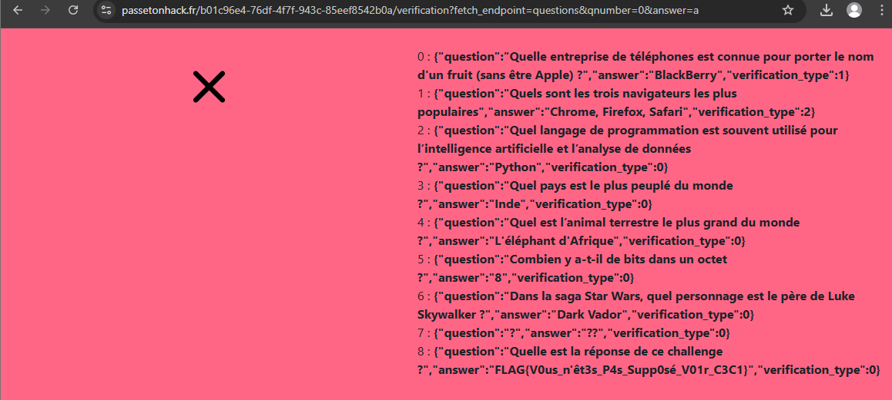

### 1. La solution

Clique simplement sur ce lien (ou copie-le dans ton navigateur) :

**`https://www.passetonhack.fr/b01c96e4-76df-4f7f-943c-85eef8542b0a/verification?fetch_endpoint=questions&qnumber=0&answer=a`**

### 2. Ce qui va se passer

En visitant ce lien, tu exploites la faille du fichier `app.js`. Le serveur va croire qu'il se parle à lui-même (localhost) et va t'afficher le contenu du fichier secret `questions.json`.

### 3. Où est le flag ?

Sur la page qui s'ouvre, tu verras du code (format JSON). Cherche le texte qui ressemble à ceci :
`FLAG{V0us_n'êt3s_P4s_Supp0sé_V01r_C3C1}`

### 4. Capture d'écran

